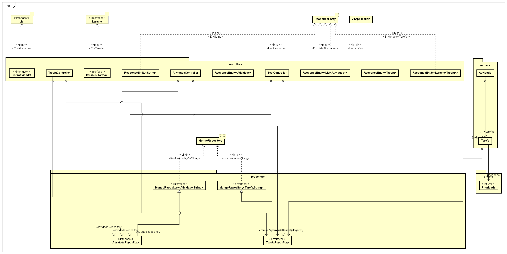
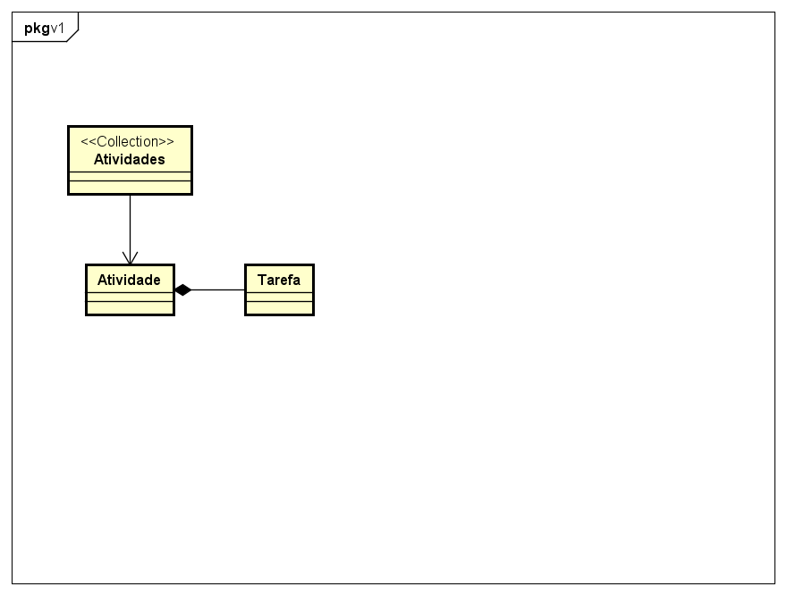

# Trabalho 1 | Engenharia de Software II

## Lucas Nardino, José Dotta, Lorenzo Turcato

### Como executar os programas

#### Frontend

``````
cd aplicacion // entrar na pasta do frontend

npm i // instalar dependências

npm start // executar o frontend
``````

#### Backend

``````
cd v1 // entrar na pasta do backend

mvn spring-boot:run // executar o backend
``````


### Diagramas

#### Diagrama de classes


#### Diagrama do Banco de Dados
